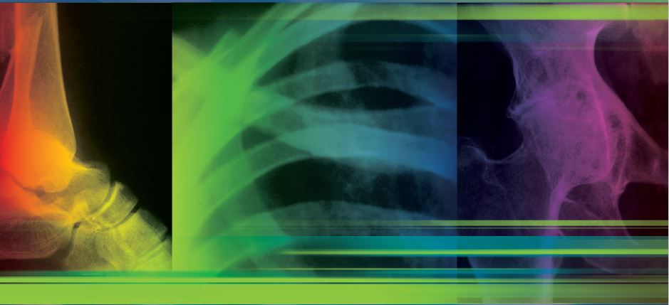

# Joseph Bernstein, MD, MS, Editor

The idea for this book took root on a chilly Sunday in April 1990 as I was nearing the end of my internship. On this particular day, I got a call from a medical resident working in the emergency department asking me to see a patient with a “fibia” fracture. The patient, it turned out, had only an ankle sprain, a common and not particularly thought-provoking injury. What got me thinking, though, was that the doctor who called me—a sharp guy, who today is probably chief of cardiology somewhere— did not know the names of the long bones. Years later, Dr. Kevin Freedman and I administered a basic competency examination in musculoskeletal medicine to all of the interns at our institution. Using a passing threshold set by directors of orthopaedic surgery and internal medicine residencies, we found that my colleague in the emergency department was not alone in his lack of mastery: a vast majority of the interns failed the test. Further work showed that nearly half of American medical schools did not require a course in musculoskeletal medicine. A theme emerged: medical students were allowed to graduate without sufficient instruction in musculoskeletal medicine, and, not surprisingly, many of them did not know enough. This book was written to help solve that problem. Musculoskeletal Medicine is a book for students. It attempts to present an overview and to help place concurrent observations, readings, and clinical experiences in perspective. It aims to serve as a springboard to further study and application. There are gaps in this book, no doubt, but they are unavoidable. To make things manageable, some detail had to be sacrificed. (The Argentinean writer Jorge Luis Borges described a library that contains everything— a flawed library, of course, because it was the size of the universe itself.) I assume that all readers own—or at least have access to—an atlas of anatomy and good textbooks of pathology, physiology, internal medicine, and general surgery. My hope is that you will read this book, but not only this book. Musculoskeletal Medicine addresses a topic of great importance. Obviously, there is an element of professional pride at work when I say that, but it is a fair claim nonetheless. The simplest reason is the large number of people with musculoskeletal conditions. Granted, few people die of bone and joint diseases, yet many people do not enjoy life to the fullest because of them. Thus, for students who went to medical school to help people, mastering musculoskeletal medicine will be an essential task. Mastering musculoskeletal medicine will be easy once you get the hang of it. I say this from the perspective of one who nearly failed out of medical school. My performance in biochemistry as a first-year student set ignominious records that probably still stand. But fortunately I had the chance later to work with teachers who not only taught the material well but also taught effective methods of learning. I hope you will find that this book carries that tradition forward. Some of the material presented may be a bit simplified—too simplified for experts in the particular field. To them, I apologize. To everyone else, I invite you to use the fundamentals presented here to acquaint yourself with this interesting and important field of medicine. Of course, I hope you won’t stop with only the basics if your interests take you further. But please, at the very least, learn the names of the long bones!