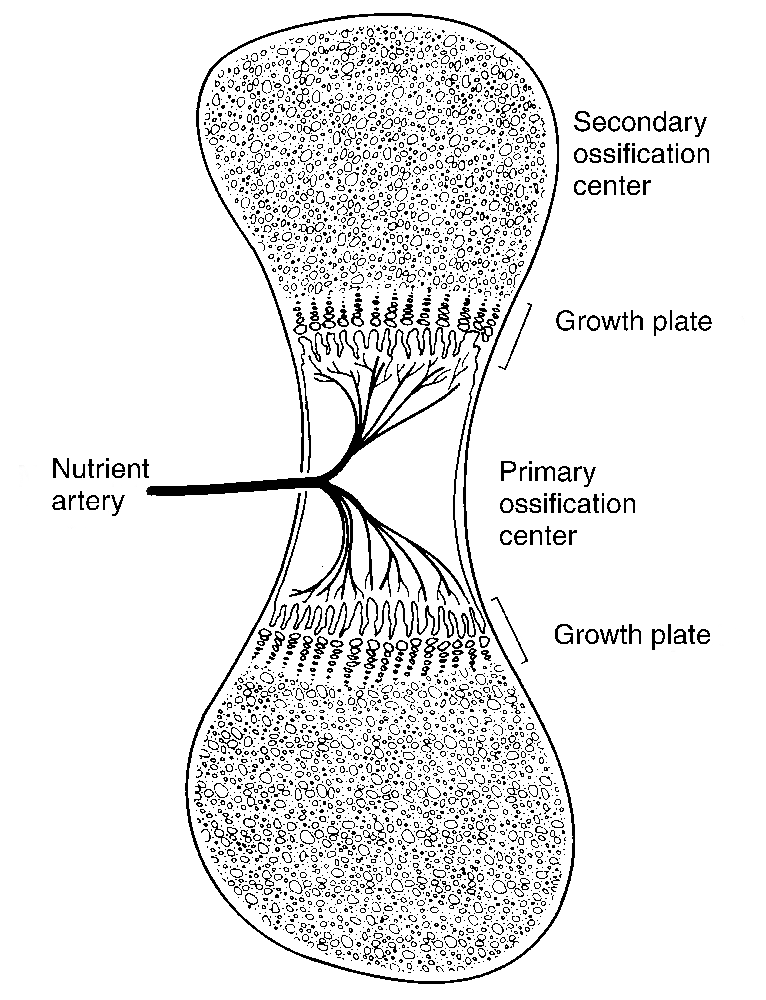
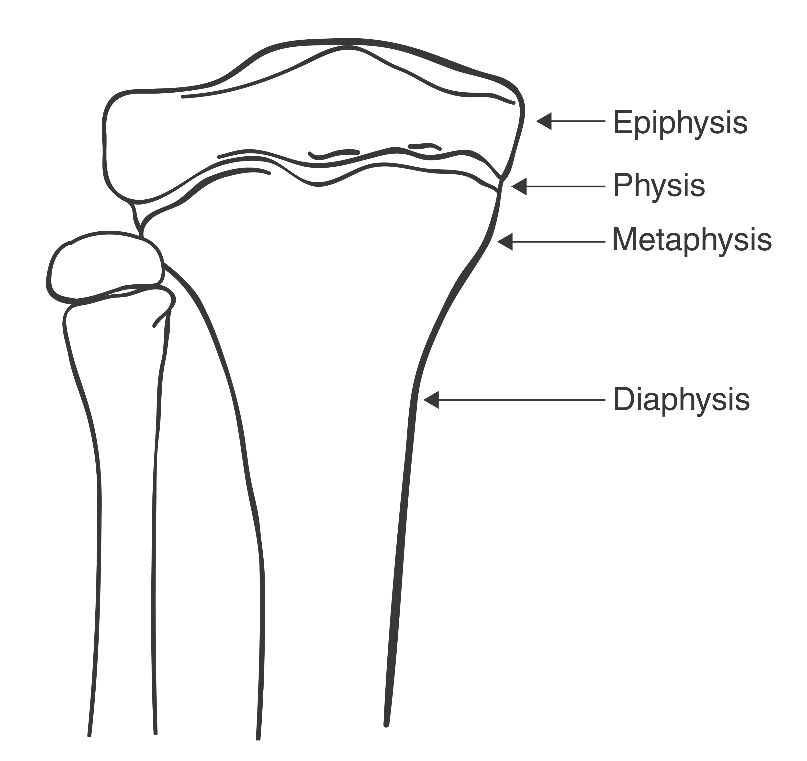

Bone forms by one of two mechanisms: endochondral or intramembranous ossification. Endochondral ossification is the most common form, producing the long bones; “long” refers to the longitudinal orientation of the bone. (Even the distal phalanx of the fifth toe is a long bone.) The flat bones, such as the skull and clavicle, form via intramembranous ossification. The key distinction between the two processes is that endochondral ossification employs a cartilage template whereas intramembranous ossification does not. Morphogenesis, or the development of the skeleton in utero, begins in the fourth week of development, at which time limb buds form in the embryo. When the fetus reaches the sixth week of development, mesenchymal cells (cells from the middle of the three germ cell layers) appear within the central region of the limb buds. These cells then differentiate into cartilage-forming chondroblasts, which elaborate a cartilage template of the bony skeleton. After these cells die, blood vessels migrate into the mass of matrix, bringing the osteoblasts, or bone-forming cells. Osteoblasts synthesize and secrete a collagen-based material called osteoid; this organic bone matrix then becomes calcified. A region of calcified cartilage called the primary center of ossification forms midway between the two ends of the long bone. Calcification begins here and continues longitudinally toward the ends of the long bone, a process called interstitial growth, which takes place entirely within the cartilage model. As interstitial growth continues, the primary ossification center enlarges, migrating toward but never ultimately reaching the ends of the bone. At the edge of the advancing primary ossification center, a specialized structure, the physis, or growth plate, forms (Fig. 1).  The physis remains cartilaginous throughout adolescence to allow longitudinal growth of the maturing skeleton. Just beyond the physeal growth plate, in the regions of the long bones farthest away from the primary ossification center, lies the chondroepiphysis. This area will become a secondary center of ossification. Some bones, such as the proximal and distal humeri, have several secondary centers of ossification that appear in a sequential manner during childhood and then fuse just before skeletal maturity to yield the adult form of the bone. The primary and secondary ossification centers on either side of the physis define the following regions of the formed bone: the diaphysis (shaft), representing the primary center; the metaphysis, the flared region just belowthe physis; and the epiphysis, which is located across the physis just below the articular cartilage lining the joint (Fig. 2).  Within the diaphysis, a central core called the medullary canal is hollowed out by resorption, creating a cavity for the future home of the blood-forming cells. As interstitial growth lengthens the bone, a parallel process of appositional growth widens the bone. Appositional growth takes place under the periosteum, a sleeve of connective tissue surrounding the shaft of the bone. The periosteum is a thick and distinct membrane in children but remains present in an attenuated form throughout life. It is the source of cells used for fracture healing and the source of some new bone formation. Endochondral ossification continues long after the skeleton ceases longitudinal growth. Instead of stopping the healing process at the scar formation stage (as most tissues are apt to do), the repair of bone continues via endochondral ossification, which converts cartilaginous scar into new bone. Thus, it is quite possible that many years after a long bone fracture, no structural evidence of the original injury exists. 
